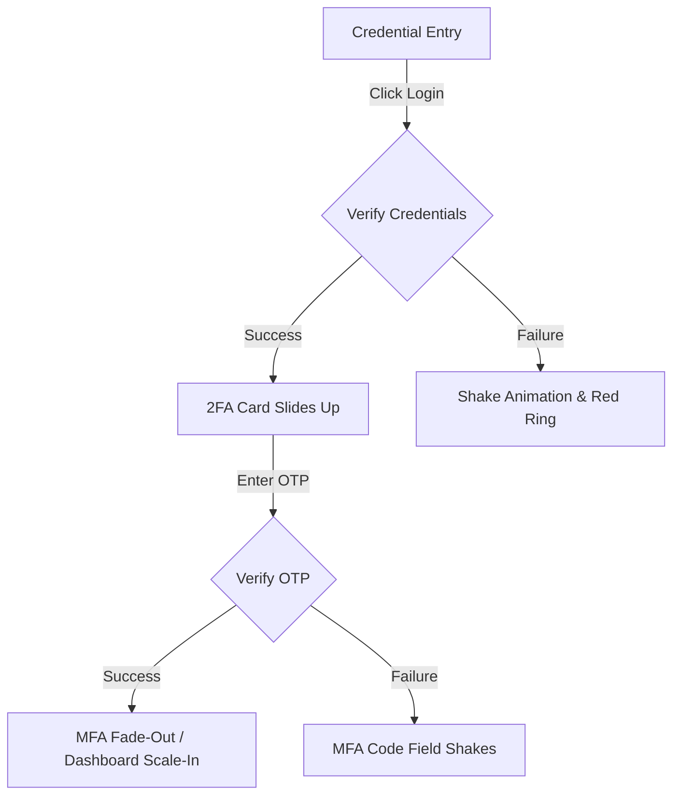
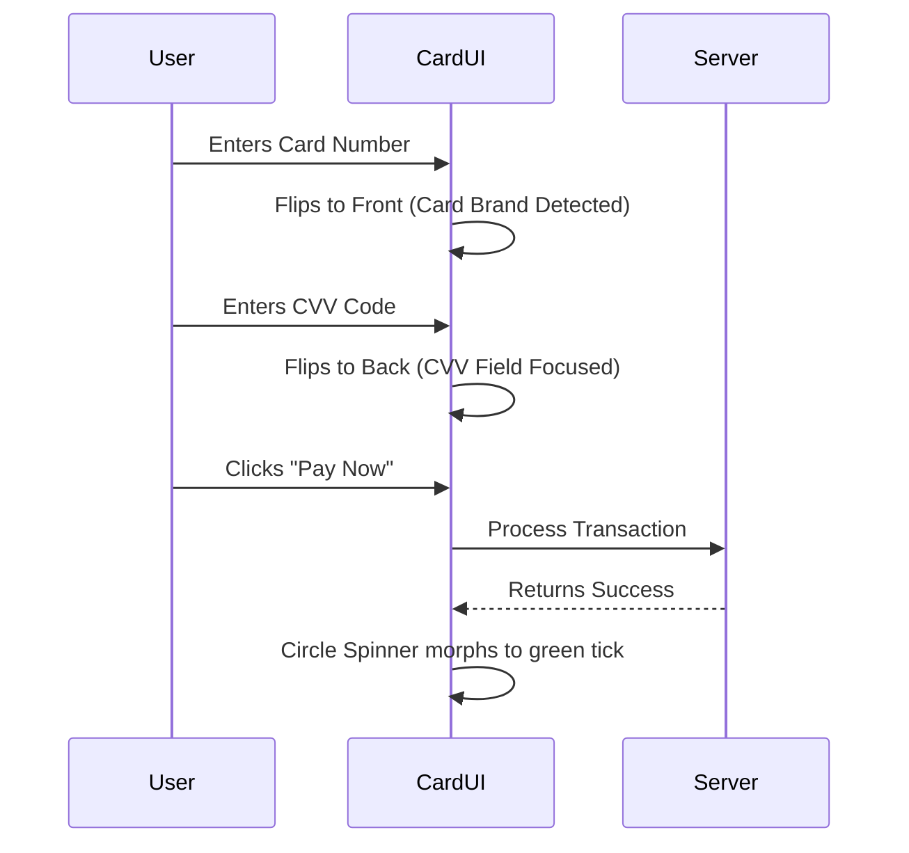

# Medikart UI/UX & Interaction Design Specifications

This document outlines the professional design system, user experience guidelines, and animation specifications for **Medikart**. These specifications draw inspiration from modern design systems (Google Stitch/Material Design 3), UI/UX resources (Craftwork.design, Figma Design Systems), and Framer-grade smooth micro-interactions.

The goal is to ensure the storefront and admin dashboards are visually polished, intuitive, accessible, and feel highly premium and interactive rather than "vibe-coded."

---

## 1. Visual Identity & Design System

### 1.1 Color Palette
Our color strategy utilizes a clean, medical-adjacent aesthetic featuring supportive warm grays and vivid interactive greens.

| Role | HEX | Tailwind Class | Application |
| :--- | :--- | :--- | :--- |
| **Primary (Brand Green)** | `#16a34a` | `bg-primary-600` / `text-primary-600` | Main CTA buttons, active states, brand headers, highlights |
| **Primary Light** | `#dcfce7` | `bg-primary-100` | Badges, success alerts backgrounds, button hover backgrounds |
| **Primary Dark** | `#15803d` | `text-primary-700` | Hover states, primary headings |
| **Background Gray** | `#f9fafb` | `bg-gray-50` | Default page background |
| **Surface White** | `#ffffff` | `bg-white` | Cards, panels, navigation bars, dropdowns |
| **Secondary Gray** | `#6b7280` | `text-gray-500` | Subtext, labels, inactive tabs |
| **Dark Neutral** | `#111827` | `text-gray-900` | Core body text, title headers |
| **Alert/Warning** | `#f59e0b` | `bg-amber-500` / `text-amber-700` | Narcotics warnings, prescription verification pending states |
| **Destructive/Error** | `#ef4444` | `bg-red-500` / `text-red-600` | Invalid field entries, checkout errors |

### 1.2 Typography Hierarchy
We leverage a highly readable, system-ui sans-serif typeface scale to present dense medical catalog information cleanly.

*   **Page Title (H1):** `text-3xl font-extrabold tracking-tight text-gray-900` (e.g., product page header)
*   **Section Heading (H2):** `text-xl font-bold text-gray-900` (e.g., checkout sections, related products)
*   **Card Title (H3):** `text-base font-semibold text-gray-800 hover:text-primary-700` (e.g., product card item name)
*   **Primary Body:** `text-sm font-normal text-gray-600 leading-relaxed`
*   **Supporting Label:** `text-xs font-medium text-gray-500` (e.g., SKU, categories, metadata)

### 1.3 Layout & Grid
*   **Storefront Container:** Max width `1280px` (`max-w-7xl px-4 sm:px-6 lg:px-8`) centered with `mx-auto`.
*   **Product Grid:** Responsive flex-grid dynamically scaling cards:
    *   Mobile: 1 column
    *   Tablet (sm/md): 2 columns
    *   Small Desktop (lg): 3 columns
    *   Large Desktop (xl): 4 columns
    *   *Tailwind utility: `grid grid-cols-1 sm:grid-cols-2 lg:grid-cols-3 xl:grid-cols-4 gap-6`*

---

## 2. Interactive Flows & Animation Specifications

All animations should be executed using **Framer Motion** (for React/Next.js) or standard hardware-accelerated **CSS Transitions/Transforms** using ease-in-out bezier curves (`cubic-bezier(0.4, 0, 0.2, 1)`).

### 2.1 Admin Login & 2FA Flow
To convey security, precision, and confidence, the Admin login flow transitions seamlessly from credentials input to two-factor authentication.



*   **Success Input Transition (Credentials to 2FA):**
    *   *Interaction:* On submitting valid credentials, the Username/Password card fades out (`opacity: 0`) and scales down (`scale: 0.95`). Simultaneously, the 2FA input card slides in from the bottom (`translateY(20px) -> translateY(0)`) and fades in (`opacity: 1`).
    *   *Timing:* `350ms`, easing: `cubic-bezier(0.16, 1, 0.3, 1)` (Ultra-smooth ease-out).
*   **Login Failure / Validation Error:**
    *   *Interaction:* The entire login card triggers a horizontal shake animation (`translateX(-10px) -> translateX(10px) -> translateX(0)`) while input borders flash crimson red (`border-red-500`).
    *   *Timing:* `400ms`, total of 4 shakes.
*   **OTP Verification Entrance:**
    *   *Interaction:* The 6 input digits appear in individual boxes. As the user types, each digit pops slightly (`scale: 1.05`) with a pulsing green indicator underneath.
*   **Successful Login Entrance to Dashboard:**
    *   *Interaction:* The login window collapses, and the Admin Dashboard container fades in (`opacity: 1`) and scales up (`scale: 0.98 -> 1`), while sidebar links slide in one by one from the left with a `50ms` stagger delay.

---

### 2.2 Storefront Catalog & Product Card Hover States
A premium catalog experience uses micro-feedback to make elements feel tactile and reactive to user presence.

*   **Product Card Elevation:**
    *   *Default:* Bordered box, flat shadow (`shadow-sm`, border color `border-gray-100`).
    *   *Hover State:* Scale up by 2% (`scale: 1.02`), translate vertically upward by `4px` (`translateY(-4px)`), and increase drop shadow depth (`shadow-md`).
    *   *Timing:* `250ms`, easing: `ease-out`.
*   **Add-to-Cart Confirmation Animation ("Flying Item"):**
    *   *Interaction:* When clicking "Add to Cart", a miniature preview bubble of the product image is cloned at the button position. It rises and scales down, following a parabolic path towards the cart icon in the navigation bar.
    *   *Cart Icon Pulse:* Upon the bubble's arrival, the cart bag icon triggers a scale pulse (`scale: 1.2 -> 0.9 -> 1.0`) and the cart count badge flashes green.
    *   *Timing:* Flying bubble: `600ms`. Cart Pulse: `300ms`.

---

### 2.3 Checkout & Payment Animations

The payment step requires the highest level of feedback to reassure customers that their transaction is safe and progressing.

#### 2.3.1 Online Card Payment Flow
For card checkouts, we mimic a real-world card interaction.



*   **Interactive Card Flip:**
    *   *Interaction:* A 3D realistic card widget floats above the form. Focusing on Card Number or Holder Name shows the front. Focusing on CVV triggers a 180-degree flip (`rotateY(180deg)`) to show the card's back.
    *   *Timing:* `500ms`, 3D perspective enabled (`perspective: 1000px`).
*   **Processing Payment Overlay:**
    *   *Interaction:* Clicks "Pay Now" -> Form disables -> Full-screen dark blur overlay (`backdrop-blur-sm bg-black/30`) fades in. A circular spinner rotates, accompanied by dynamic text: "Securing connection..." -> "Authorizing funds..." -> "Success!"
*   **Success Resolution:**
    *   *Interaction:* The circular spinner morphs organically into a checkmark (`svg dasharray offset animation`), the overlay fades, and the page redirects with a slide-left transition to the Order Confirmation page.

#### 2.3.2 Cash on Delivery (COD) Flow
COD checkout should feel physical and grounded, celebrating the order placement without the security-heavy feel of credit card processing.

*   **Order Placement Animation (The Delivery Box):**
    *   *Interaction:* Upon clicking "Place COD Order", a stylized 2D flat vector shipping box drops down into view, folds its flaps shut, and a green checkmark stamp slams down onto the top of the box.
    *   *Timing:* Box drop: `400ms` (with bounce). Flap fold: `200ms`. Stamp slam: `150ms`.
*   **Success Delivery Banner:**
    *   *Interaction:* On the confirmation screen, a stylized delivery truck drives into the viewport from the left, decelerates, and displays the estimated arrival date above the truck bed.

---

## 3. General UX Micro-Feedback Patterns

### 3.1 Skeleton Screen Loaders
Avoid full-page loading spinners. Use skeleton loaders to keep users engaged and reduce perceived loading times.
*   *Interaction:* Gray placeholder blocks (`bg-gray-200`) match the geometric shapes of text lines, product images, and buttons. A subtle left-to-right gradient sweep (`shimmer effect`) animations across the skeletons.
*   *Timing:* Shimmer loop: `1.5s` infinite, linear.

### 3.2 Action Toast Notifications
*   *Interaction:* Add-to-cart or error events pop up a toast in the top-right corner (or bottom-center on mobile).
*   *Entrance:* Slide in from the right (`translateX(100%) -> translateX(0)`) with an elastic overshoot.
*   *Exit:* Auto-fades (`opacity: 0`) and slides up (`translateY(-20px)`) after 4 seconds of inactivity.

---

## 4. Accessibility & Responsive Guidelines (WCAG 2.1)

*   **Contrast Ratio:** Standard body text matches a minimum ratio of `4.5:1` against white backgrounds (achieved with Tailwind `text-gray-600` and `text-gray-900`).
*   **Focus Ring Indicators:** Focus states (`:focus-visible`) must be visible, utilizing a clear ring offset (`ring-2 ring-primary-500 ring-offset-2`).
*   **Reduced Motion:** Support users with motion sensitivities. All transitions and animations must check for the media query and scale down to static transitions:
    ```css
    @media (prefers-reduced-motion: reduce) {
      * {
        animation-duration: 0.01ms !important;
        animation-iteration-count: 1 !important;
        transition-duration: 0.01ms !important;
        scroll-behavior: auto !important;
      }
    }
    ```
